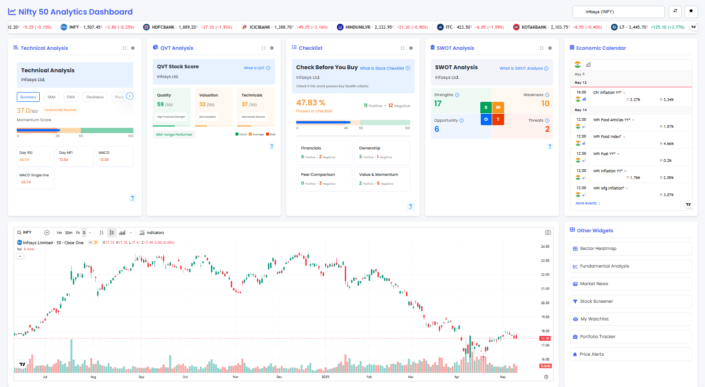

# Stock Widgets – Docker Image

[](https://github.com/Amits64/stock-widgets/actions/workflows/workflow.yml)

## 🚀 Overview

`amits64/stock-widgets` is a Dockerized Nginx-powered dashboard for real-time Nifty 50 stock analytics.  It delivers interactive widgets, dynamic charts, and quick insights into market trends—all in a lightweight, easily deployable container.

### Key Features

* **Nginx‑serving static & dynamic assets**: Blazing‑fast delivery with caching and compression.
* **Searchable Nifty 50 selector**: Instant lookup of any stock in the index.
* **Pre-integrated widgets**:

  * Technical Analysis
  * QVT Score
  * Checklist & SWOT
  * Economic Calendar
* **Fully client‑side**: No backend dependencies—just serve HTML/JS/CSS.
* **Responsive design**: Works on desktop, tablet, and mobile.

---

## 🎨 Screenshots

<p align="center">
  
</p>

---

## 🛠️ Quick Start

### 1. Pull the image

```bash
docker pull amits64/stock-widgets:latest
```

### 2. Run the container

```bash
docker run -d \
  -p 8080:80 \
  --name stock-widgets \
  amits64/stock-widgets:latest
```

### 3. View the dashboard

Open your browser at: `http://localhost:8080`

> Tip: Map a custom config via `-v $(pwd)/nginx.conf:/etc/nginx/nginx.conf:ro` to tweak caching or add HTTPS.

---

## ⚙️ Configuration

All configuration is handled via environment variables or by mounting custom Nginx files.

| Variable             | Default | Description                                     |
| -------------------- | ------- | ----------------------------------------------- |
| `PORT`               | `80`    | Port on which Nginx listens                     |
| `STOCK_SYMBOLS_JSON` | —       | (Optional) Path/URL to override stock list JSON |

### Custom Nginx

To override `nginx.conf`:

```bash
docker run -d -p 8080:80 \
  -v /path/to/nginx.conf:/etc/nginx/nginx.conf:ro \
  amits64/stock-widgets
```

---

## 🧩 Architecture

```
+----------------------+       +--------------------+
|   Client Browser    | <---> |      Nginx         |
| (HTML/JS/CSS only)  |       |  (Docker Container)|
+----------------------+       +--------------------+
                                      |
                                      v
                            +----------------------+
                            | Static Assets &      |
                            | Pre‑built Widgets JS |
                            +----------------------+
```

* All data fetching (Trendlyne, TradingView) happens client‑side.
* Nginx purely serves files—no application server.

---

## 📁 Repository Structure

```
├── Dockerfile
├── nginx.conf            # default Nginx settings
├── index.html            # main dashboard
├── assets/               # JS, CSS, icons
├── docs/
│   └── screenshot-dashboard.png
└── README.md
```

---

---

## 🐞 Troubleshooting

If you encounter any issues running the dashboard, try the following:

1. **Container fails to start**

   * Check container logs:

     ```bash
     docker logs stock-widgets
     ```
   * Ensure port `8080` (or your mapped port) is free.

2. **Dashboard not loading / blank page**

   * Confirm the container is running:

     ```bash
     docker ps | grep stock-widgets
     ```
   * Verify your browser console for JavaScript errors (press F12).
   * Make sure external widget scripts (Trendlyne, TradingView) are reachable from your network.

3. **Static assets 404 errors**

   * If you mounted a custom `nginx.conf`, ensure the `root` path matches the location of `index.html` inside the image (`/usr/share/nginx/html`).

4. **Favorites not persisting**

   * The dashboard uses `localStorage` in your browser; ensure cookies and local storage are enabled.

5. **Need HTTPS / custom domain**

   * Place the container behind a reverse proxy (Traefik, Caddy) or use `-v` to mount your TLS certs into Nginx.

---

## ❓ FAQ

**Q: Can I use this with indices other than Nifty 50?**
A: Yes—override the `STOCK_SYMBOLS_JSON` environment variable with a JSON list of symbols to display.

**Q: How do I update to the latest code?**
A: Pull the new image tag and restart the container:

```bash
docker pull amits64/stock-widgets:latest
docker stop stock-widgets && docker rm stock-widgets
docker run -d -p 8080:80 --name stock-widgets amits64/stock-widgets:latest
```

**Q: Can I add my own widgets?**
A: Simply edit `index.html` (or mount a custom version) to include additional `<script>` blocks or HTML cards.

---

## 🤝 Contributing

1. Fork the repo
2. Create a feature branch (`git checkout -b feature/xyz`)
3. Commit your changes (`git commit -m "Add xyz"`)
4. Push (`git push origin feature/xyz`)
5. Open a PR against `main`

Please follow the [contribution guidelines](CONTRIBUTING.md) and code style.

---

## 📝 License

This project is licensed under the MIT License. See [LICENSE](LICENSE) for details.

---

© 2025 Amit S.

